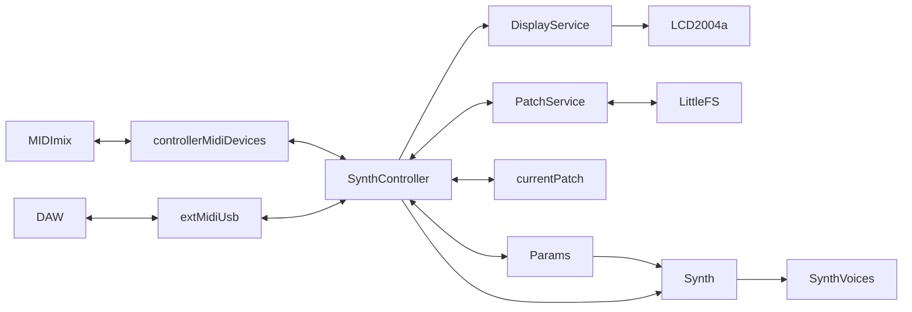

# Code

[Back to README.md](README.md)

__Please note:__ this project only uses header files for C++ classes.

_But why?!_

They say "a good programmer is a lazy programmer", so I must be a very good programmer.

_But I don't agree!_

Call the C++ police.

## Editing / building the source code

This project uses [PlatformIO](https://platformio.org/).

When using Windows, first [install Python](https://docs.platformio.org/en/latest/faq/install-python.html).
Next, install [Visual Studio Code](https://code.visualstudio.com/).
Inside Visual Studio Code, go to extensions, search PlatformIO and install the extension.

Both PlatformIO and Visual Studio Code are free and open-source software.

Use the _build_ and _upload_ commands for building and uploading the project.

_Please read the next chapter as well before running creating a build!_

Some additional steps may be needed when using Linux:

Please follow the instructions in this file:
[UDEV Rules for Teensy boards](https://www.pjrc.com/teensy/00-teensy.rules).

Ubuntu (and other Debian derivates) user might have to uninstall _brltty_:
```bash
apt remove brltty
```

## Modifications in Teensy Audio

This project expects a few small modifications to the Teensy Audio library:
https://github.com/PaulStoffregen/Audio/pull/475/files

_Without these modifications, the build will fail._

Alternatively you can disable the calls to the restart() method by uncommenting the following line in [main.cpp](main.cpp):
```cpp
#define DISABLE_OSC_RESTART
```
The synthesizer will still work but it won't restart the oscillator phase on note on, which might result in odd out-of-phase effects between the 2 oscillators after adjusting the oscillator detune.

The location of these files depends on your operating system.

Linux / macOS:
```
~/.platformio/packages/framework-arduinoteensy/libraries/Audio
```

Windows:
```
%userprofile%\.platformio\packages\framework-arduinoteensy\libraries\Audio
```

Additionally, AUDIO_BLOCK_SAMPLES needs to be reduced from 128 to 16 to improve responsiveness, reduce latency and reduce memory usage:

Linux / macOS:
```
~/.platformio/packages/framework-arduinoteensy/cores/teensy4/AudioStream.h
```

Windows:
```
%userprofile%\.platformio\packages\framework-arduinoteensy\cores\teensy4\AudioStream.h
```

Find:
```C++
#define AUDIO_BLOCK_SAMPLES  128
```

And replace it with:
```C++
#define AUDIO_BLOCK_SAMPLES  16
```

## Code structure and flow of data and control

The flow of data and control within the code is roughly as follows:


### MIDI

Notes and parameter changes enter the flow through two separate MIDI paths: controller and external.

The MIDImix is connected to the USB Host interface. MIDI messages entering from this path are handled as _controller_ messages. The MIDImix sends out control changes for dials/sliders and notes for buttons. Button lights can be turned on/off by sending back notes. The default note and control change layout of the MIDImix is used. For more information, see: [(Unofficial) Akai Professional MIDImix Communications Protocol Guide](https://docs.google.com/document/d/1zeRPklp_Mo_XzJZUKu2i-p1VgfBoUWF0JKZ5CzX8aB0/edit?usp=sharing) by Julian Ceipek. It is possible to connect a additional MIDI keyboard to the USB host interface using a USB hub (I used a Nektar SE25 during development), but low notes will be interpreted as button presses on the MIDImix.

The TeensyMix Synth is connected to a PC running a Digital Audio Workstation (DAW) using the regular USB interface. MIDI messages entering from this path are considered as _external_ messages. The control change layout follow the `PARAM_MC_` constants in [src/ConstantValues.h](src/ConstantValues.h)

### SynthController

The SynthController is at the heart of the synthesizer. It handles incoming MIDI messages, translating MIDImix notes and control changes into parameter changes in the synthesizer, handles action buttons such as load and save, sends information to the display, etc. 

### DisplayService

The DisplayService translates display infomation from the SynthController into commands for the LCD2004a display.

### PatchService

The PatchService handles loading and saving patches to [LittleFS](https://github.com/PaulStoffregen/LittleFS).

### currentPatch

A Patch consists of a name and a map of parameter ID / paramters value pairs. The SynthController uses the currentPatch to keep track of the current state of all parameters.

### Params

A Param represents a paramters of the synthesizer affecting either the sound or the behaviour. A Param describes:
* parameter ID
* (external) MIDI control change
* controller control change
* controller note increment
* controller note decrement
* initial value
* maximum value
* function reference to a (lambda) function to be called to update the synthesizer (whenever the parameter value changes)
* function reference to a (lambda) function to convert a parameter value to a text to be displayed on the display

Params are defined in [src/ConstantParams.h](src/ConstantParams.h).

### Synth

The Synth handles the polyphony of the synthesizer. It passes parameter changes to all voices, handles the LFO and mixes the voices to a single output.

### SynthVoices

A SynthVoice contains the actual oscillators, envelope generators, filters, etc.

