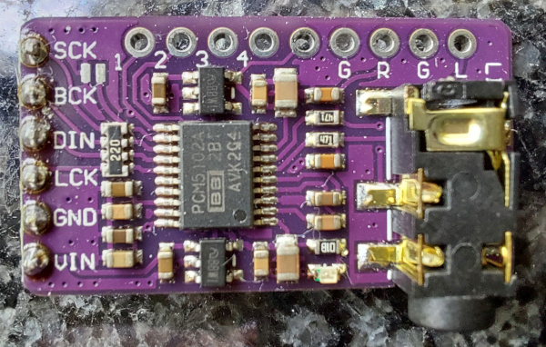
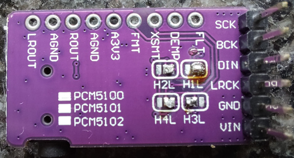
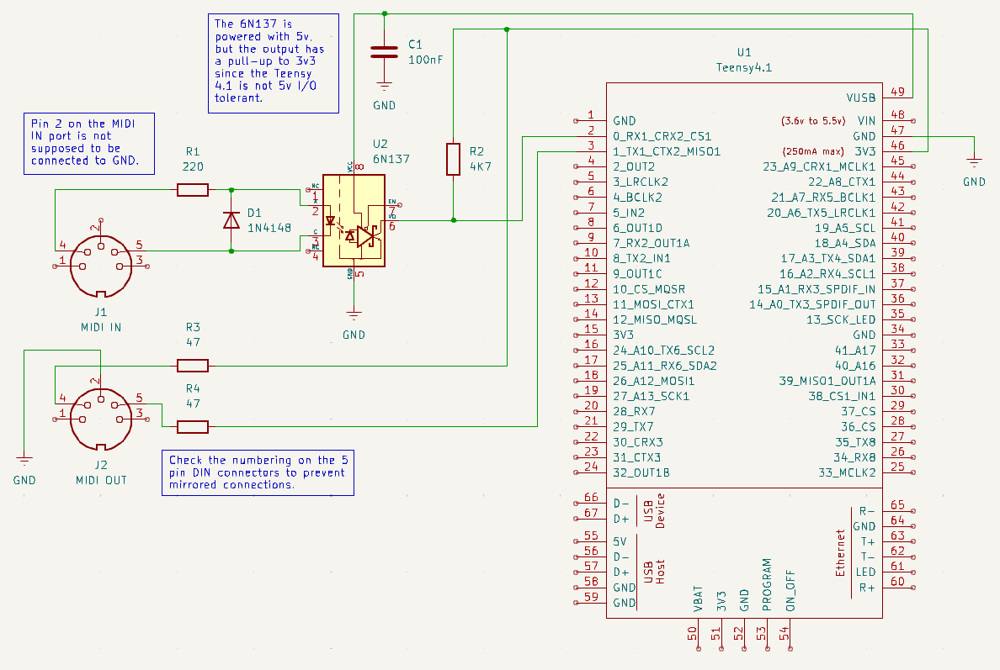

# Hardware

[Back to README.md](README.md)

Minimal required hardware to get started on a breadboard:
- [PJRC Teensy 4.1 development board](https://www.pjrc.com/store/teensy41.html)
- [USB Host Cable For Teensy 3.6 or Teensy 4.1](https://www.pjrc.com/store/cable_usb_host_t36.html) or create your own using the pinout provided with the Teensy 4.1
- PCM5102a digital to analog converter
- Akai MIDImix
- Micro SD card
- Optional but recommended: LCD2004a display, preferably a 3.3 volt version
- Optional: 5 pin DIN MIDI interface circuitry

## Connecting the hardware

### Micro SD card

A Micro SD card is used for patch storage. You can store patches in the Teensy Flash ROM as well. The code in [PatchService](src/PatchService.h) does initialize LittleFS but is currently hardcoded to store patches to SD. Using SD makes it easier to copy / backup / retore your patches.

Patches are stored in a folder `tmixpatch` in the root of the SD card. To load the initial patches, copy the [tmixpatch](tmixpatch) folder (including the folder) to the root of the SD card.

### LCD display

_Using a display is optional, but strongly recommended._

The display used in this project is the LCD2004a. It is inexpensive and widely available. Please make sure you get a 3.3v version.

It is possible to use a 5v display, see [this page](https://www.pjrc.com/teensy/td_libs_LiquidCrystal.html) for more information.
Be aware that the Teensy 4.1 is not 5v I/O tolerant. So follow the instructions carefully and make sure that the R/W line is always connected to ground.

| LCD Pin | LCD Function            | Teensy Pin |
| :------ | :---------------------- | :--------- |
| 1       | Ground (Vss)            | GND        |
| 2       | +3.3 Volts (Vdd)        | 3.3V       |
| 3       | Contrast Adjust (V0)    | see below  |
| 4       | RS                      | 12         |
| 5       | R/W                     | GND        |
| 6       | Enable (E)              | 11         |
| 7       | D0                      |            |
| 8       | D1                      |            |
| 9       | D2                      |            |
| 10      | D3                      |            |
| 11      | D4                      | 5          |
| 12      | D5                      | 4          |
| 13      | D6                      | 3          |
| 14      | D7                      | 2          |
| 15      | Backlight Power Anode   | 3.3V       |
| 16      | Backlight Power Cathode | GND        |

See [Teensy 4.1 pinout](https://www.pjrc.com/store/teensy41.html#pins) for the location of the Teensy pins.

Pin 3 Contrast Adjust (V0) should be connected to the middle pin of a 10K ohm potentiometer, with the other two pins connected to GND and 3.3V. This allows you to adjust the contrast of the display according to the desired viewing angle.

You could skip the potentiometer and connect Pin 3 Contrast Adjust (V0) to GND instead. This resulted in the right contrast on my display.

You can use [this sketch](https://github.com/arduino-libraries/LiquidCrystal/blob/master/examples/HelloWorld/HelloWorld.ino) to verify that your display is working correctly.

### Digital to analog converter

The digital to analog converter used in this project is a PCM5102a. These are sold on development boards in several different form factors and configurations.

I used a small rectangular purple board that is inexpensive and widely available.

You might need to configure the "jumpers" on the back however. I bought several ones from different vendors. One came with the "jumpers" configured correctly, using tiny barely visible 0 ohm resistors. Others came unconfigured. You can set the "jumpers" using blobs of solder. 1, 2 and 4 need to be set to L, 3 needs to be set to H.

| PCM5102a board | Teensy pin |
| :------------- | :--------- |
| SCK            | GND        |
| BCK            | 21         |
| DIN            | 7          |
| LRCK           | 20         |
| GND            | GND        |
| VIN            | 5V         |

See [Teensy 4.1 pinout](https://www.pjrc.com/store/teensy41.html#pins) for the location of the Teensy pins.

It should be possible to use other PCM5102 based boards. This particular board runs on 5V, I believe is has an on-board voltage regulator. When using a different board, please double check the voltage.

You can use [this sketch](https://github.com/PaulStoffregen/Audio/tree/master/examples/Synthesis/Guitar) to verify that your PCM5102a board is working correctly. You should hear a guitar strumming. _Warning: the output volume of this quite high!_

You might get some background noise due to ground loops if you connect the Teensy to your PC using USB. You can use a Hum Destroyer such as the [Behringer HD400](https://www.behringer.com/product.html?modelCode=0811-AAA) to solve this issue. Alternatively, you could try using 5 pin DIN MIDI and power the Teensy using a separate power supply. But make sure you do __not__ buy/use [this crappy USB-MIDI adapter](http://clx.freeshell.org/cjs1039-midi-interface.html), even a modified version probably won't work.

### Akai MIDImix

The Akai MIDImix connects to the Teensy using the [USB Host Cable For Teensy 3.6 or Teensy 4.1](https://www.pjrc.com/store/cable_usb_host_t36.html). You can also create your own cable using the pinout provided with the Teensy 4.1.

_Make sure you do not reverse the connector to the Teensy! This might damage your Teensy and/or the USB device connected to the Teensy!_

You can use [this sketch](https://github.com/PaulStoffregen/USBHost_t36/tree/master/examples/HIDDeviceInfo) to verify that the connection between the MIDImix and Teensy is working correctly. You might want to consider testing with a cheaper device (such as an old mouse) first, especially if you create your own cable.

### MIDI Interface

_Using a 5 pin DIN MIDI interface is optional. The USB connection to the computer provides a USB MIDI device as well._

The schematic based on a 6N137 opto-coupler is as follows:

Alternatively you could follow [this 6N138 based schematic](https://www.pjrc.com/teensy/td_libs_MIDI.html).

Make sure you do __NOT__ buy/use [this crappy USB-MIDI adapter](http://clx.freeshell.org/cjs1039-midi-interface.html), even a modified version probably won't work.
